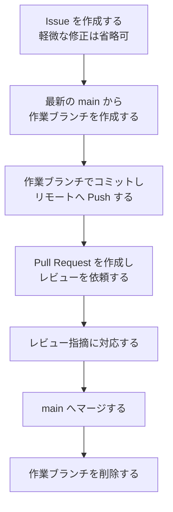
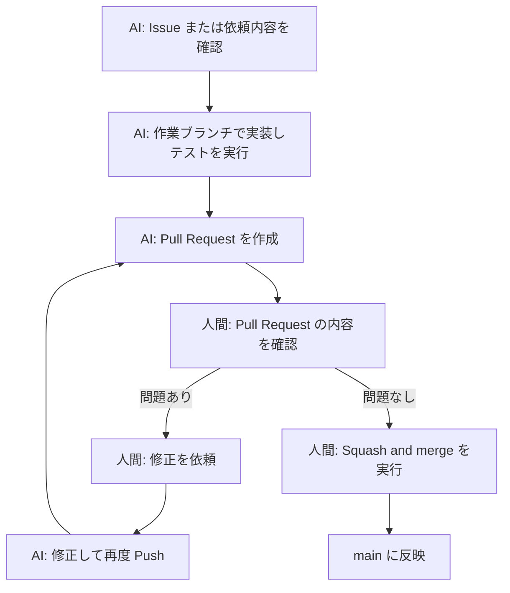
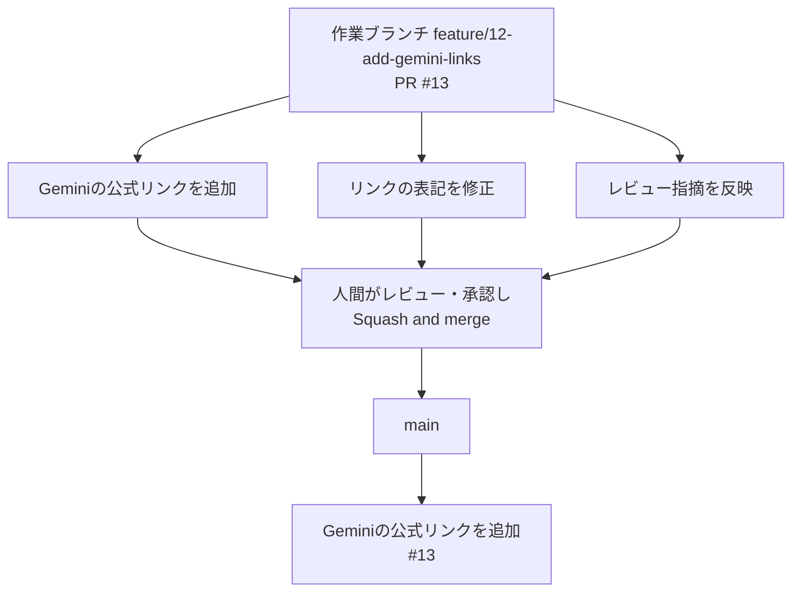

# Git ブランチ運用ルール

## 1. 目的

本ルールは、Git ブランチの運用方法を統一するためのものです。

本プロジェクトは小規模な社内開発のため、シンプルな **GitHub フロー** を採用します。

以下を重視します。

- `main` ブランチを常に正しい状態に保つ
- 誰がどの作業をしているか分かる
- Issue・Pull Request・ブランチの関係を追える
- ブランチ管理そのものに時間をかけない

---

## 2. 基本ルール

ブランチは以下のルールで運用します。

1. `main` ブランチは常に公開・リリース可能な状態に保つ
2. 作業は必ず `main` から作業ブランチを作成して行う
3. `main` ブランチへの直接 Push は禁止する
4. 変更は Pull Request を作成し、レビュー後に `main` へマージする
5. マージ後の作業ブランチは削除する

`develop`、`release`、`hotfix` などのブランチは作成しません。

---

## 3. ブランチ構成

| ブランチ | 用途 | 寿命 |
|---|---|---|
| `main` | 公開・リリース可能な最新状態 | 常設 |
| 作業ブランチ | 機能追加・バグ修正・ドキュメント修正 | マージまで（短期間） |

---

## 4. 作業の流れ



### コマンド例

```bash
# 最新の main を取得
git switch main
git pull origin main

# 作業ブランチを作成
git switch -c feature/12-add-gemini-links

# 変更をコミットして Push
git add index.html
git commit -m "Geminiの公式リンクを追加"
git push -u origin feature/12-add-gemini-links
```

---

## 5. ブランチ名

ブランチ名は以下の形式とします。

```text
<種類>/<Issue番号>-<作業内容>
```

### 種類

Issue テンプレート・Pull Request テンプレートの種類に合わせます。

| 種類 | 用途 | 対応テンプレート |
|---|---|---|
| `feature` | 機能追加・変更、リンク追加 | `feature.md` |
| `fix` | バグ修正 | `bug.md` |
| `docs` | ドキュメント修正 | `documentation.md` |
### 命名ルール

- 英小文字・数字・ハイフン（`-`）を使用する
- 作業内容は英語で簡潔に記載する
- Issue がない場合は Issue 番号を省略する

### 推奨

```text
feature/12-add-gemini-links
fix/15-broken-chatgpt-link
docs/18-update-readmefix
```

### 避ける

```text
test
tmp
takashi-work
feature/修正
Fix_Link
```

---

## 6. 作業ブランチの粒度

原則として、**1ブランチ = 1 Issue = 1 Pull Request** とします。

- 無関係な変更を同じブランチに含めない
- 長期間マージしないブランチを作らない（目安：数日以内）
- 作業が大きくなる場合は Issue を分割し、ブランチも分ける

---

## 7. コミット

- コミットは意味のある単位で行う
- コミットメッセージは何を変更したか分かる内容にする
- 機密情報（API キー、パスワード、アクセストークン等）をコミットしない
- 不要なデバッグコードや一時ファイルをコミットしない

### 推奨

```text
Geminiの公式リンクを追加
ChatGPTのリンク切れを修正
ページタイトルを変更
```

### 避ける

```text
修正
update
wip
```

---

## 8. main ブランチとの同期

作業中に `main` が更新され、競合が発生した場合は、作業ブランチに `main` を取り込んで解消します。

```bash
git switch main
git pull origin main
git switch feature/12-add-gemini-links
git merge main
```

Push 済みのブランチに対して、`git rebase` や `git push --force` は原則として使用しません。

---

## 9. マージ

マージは Pull Request 経由でのみ行います。

### マージ実施者

**マージ操作は必ず人間が行います。**

- AI エージェント（Claude Code、GitHub Copilot 等）や自動化ツールにマージ操作をさせない
- GitHub Actions 等によるマージの自動化は行わない
- GitHub の「Auto-merge（自動マージ）」機能は使用しない
- AI エージェントが作成した Pull Request も、人間が内容を確認したうえでマージする

### AI エージェントと人間の役割分担

AI エージェントは「変更を作って、マージできる状態に整える」まで、人間は「変更を確認して、マージしてよいか決めて、マージする」を担当します。

#### 全体の流れ



#### AI エージェントの責務

| # | 作業 | 内容 |
|---|---|---|
| 1 | Issue の確認 | Issue がある場合は、Issue に書かれた「対応内容」「完了条件」を確認する。Issue がない軽微な修正の場合は、依頼内容と完了条件を確認する |
| 2 | 実装 | 作業ブランチを作成し、変更を加えてコミット・Push する |
| 3 | テスト・Lint の実行 | 動作確認を行う。Lint（書き方のチェック）を導入している場合は実行する |
| 4 | Pull Request の作成 | PR テンプレートに沿って本文を記載する |
| 5 | セルフレビュー | 自分の変更に誤り・不要な変更・機密情報がないか見直す |
| 6 | レビュー指摘への対応 | 人間からのコメントに沿って修正し、再度 Push する |
| 7 | CI 結果の確認 | CI（GitHub 上の自動チェック）を導入している場合は、成功しているか確認する |
| 8 | マージ可能な状態にする | 上記がすべて完了したら、人間にレビューを依頼する |

**AI エージェントの作業はここまでです。マージはしません。**

#### 人間の責務

| # | 作業 | 内容 |
|---|---|---|
| 1 | 変更内容のレビュー | PR の「Files changed」タブで、何が変更されたか確認する |
| 2 | CI・テスト結果の確認 | PR に記載された確認内容を確認する。CI を導入している場合は、PR 画面下部のチェック結果がすべて成功（緑のチェック）か確認する |
| 3 | Issue 要件の確認 | Issue の「完了条件」を満たしているか確認する |
| 4 | 修正依頼 | 問題があれば PR にコメントし、AI エージェントに修正を依頼する |
| 5 | マージ可否の判断 | 問題がなければ PR を承認（Approve）する。承認は PR 作成者以外のメンバーが行う |
| 6 | マージの実行 | PR 画面下部のボタンで「Squash and merge」を選び、実行する |

**判断に迷う場合はマージせず、他のメンバーに相談してください。**

> **注意：自分が作成した PR は自分で承認できません**
>
> AI エージェントが自分の GitHub アカウントで PR を作成した場合、GitHub 上はその PR の作成者は自分になります。GitHub では PR 作成者が自分の PR を承認（Approve）できないため、承認は他のメンバーに依頼してください。
>
> レビュー担当者を確保できず「11. ブランチ保護」で Require approvals を設定していない場合に限り、承認を省略し、#1〜#3 の確認を自分で行ってからマージして構いません。

#### AI エージェントの禁止事項

AI エージェントは、以下を行ってはなりません。

| 禁止事項 | 理由 |
|---|---|
| Pull Request のマージ、Auto-merge の有効化 | 人間の確認なしに `main` へ反映されるため |
| `main` / `master` ブランチへの直接 Push | レビューを経ずに `main` が変更されるため |
| ブランチ保護ルール（Branch Protection Rules・Ruleset）の変更 | 上記の安全策そのものを無効にできるため |
| 必須レビュー・必須チェック（Required Review・Required Status Checks）の回避 | 確認されていない変更がマージされるため |
| 管理者権限を利用した保護ルールの回避 | 同上 |

AI エージェントからこれらの操作を求められた場合や、実行された形跡がある場合は、作業を止めて他のメンバーに共有してください。

#### 用語

| 用語 | 意味 |
|---|---|
| Pull Request（PR） | 「この変更を `main` に取り込んでください」という依頼。変更内容の確認やコメントのやり取りを行う場所 |
| マージ | 作業ブランチの変更を `main` に取り込むこと |
| CI | Push や PR 作成時に GitHub 上で自動実行されるチェック |
| Lint | コードや文章の書き方を自動でチェックすること |
| Squash and merge | PR 内の複数コミットを1つにまとめて `main` に取り込むマージ方法 |

### マージ前の確認

以下を確認してからマージします。マージ前の確認項目は本節を正とし、[Pull Request 作成ルール](./pull-request-rules.md) からも本節を参照します。

- 必要なレビュー（承認）が完了している
- レビュー指摘への対応が完了している
- PR の「確認内容」が実施済みで、必要なテストが成功している（CI を導入している場合は CI も成功している）
- Issue がある場合は、その完了条件を満たしている
- `main` との競合が解消されている
- マージして問題ない状態である

### マージ方法

原則として **Squash and merge** を使用します。

- 1 Pull Request が `main` 上で1コミットになり、履歴を追いやすくするため
- コミットメッセージは Pull Request のタイトルを基本とする
- Pull Request 内では複数の作業コミットを許可する



---

## 10. マージ後のブランチ削除

マージ後の作業ブランチは削除します。

- GitHub の Pull Request 画面の「Delete branch」で削除する
- ローカルのブランチも、PR のマージと変更の反映を確認し、未反映の作業がない場合に削除する

```bash
git switch main
git pull origin main
git branch -d feature/12-add-gemini-links
```

Squash and merge では作業ブランチの元のコミットが `main` の履歴に残らないため、`git branch -d` が未マージと判定して失敗することがあります。その場合は PR がマージ済みで、変更が `main` に反映され、ローカルブランチに残すべき作業がないことを確認してから、`git branch -D feature/12-add-gemini-links` でローカルブランチを削除します。これらを確認できない場合は削除しません。

`git branch -D` は未マージの作業も強制的に削除するため、**必ず人間が実行します**。AI エージェントは `git branch -D` を実行せず、削除が必要な場合は人間に依頼します。

GitHub のリポジトリ設定「Automatically delete head branches」を有効にすることを推奨します。

---

## 11. ブランチ保護

`main` ブランチには、GitHub のブランチ保護ルールを設定することを推奨します。

| 設定 | 内容 |
|---|---|
| Require a pull request before merging | Pull Request 経由でのみマージ可能にする |
| Require approvals | マージ前のレビュー承認を必須にする（1名以上。PR 作成者は自分の PR を承認できないため、他のメンバーの承認が必要） |
| Do not allow bypassing the above settings | 管理者も同じルールに従う |
| Allow force pushes | 無効にする |
| Allow deletions | 無効にする |

レビュー担当者を確保できない場合は、Require approvals の設定を外しても構いません。

---

## 12. 禁止事項

以下は行いません。

- `main` ブランチへの直接 Push
- `main` ブランチへの `git push --force`
- Pull Request を経由しないマージ
- AI エージェント・自動化ツールによるマージ、および Auto-merge の使用
- ブランチ保護ルールの回避（管理者権限の利用を含む）
- 内容が分からないブランチ名での作業
- 無関係な変更を1つのブランチにまとめる
- 機密情報を含むコミット

---

## 13. 運用方針

ブランチ運用が負担にならないよう、以下を基本方針とします。

- ブランチの種類を増やしすぎない
- 作業ブランチは短期間でマージする
- マージ済みのブランチは残さない
- 迷った場合は `main` から新しいブランチを作成する

運用して不足を感じたルールのみ、後から追加します。
