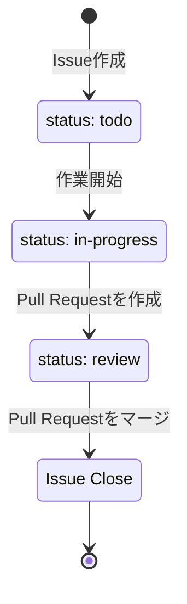

# GitHub Issue 作成ルール

## 1. 目的

本ルールは、GitHub Issue の書き方を統一するためのものです。

以下を重視します。

- 誰が見ても「何をする Issue か」が分かる
- 作業の抜け漏れを防ぐ
- Issue と Pull Request の関係を追える
- 必要以上に Issue 作成・管理へ時間をかけない

---

## 2. 基本ルール

Issue は以下のルールで作成します。

1. **1 Issue = 1つの作業**を基本とする
2. タイトルだけで作業内容がある程度分かるようにする
3. 「概要」「対応内容」「完了条件」を記載する
4. 小さな修正は無理に Issue 化しない
5. 実装した場合は Pull Request から Issue を参照する

---

## 3. Issue を作成する作業

以下のような作業は Issue を作成します。

- 新機能の追加
- 既存機能の変更
- バグ修正
- ページ構成・デザインの変更
- 複数日にまたがる作業
- 後から対応する必要がある作業

以下のような軽微な作業は、Issue を作成せず Pull Request のみでも構いません。

- 誤字・表記修正
- コメント修正
- 軽微なリファクタリング
- 数分程度で完了する明らかな修正

判断に迷う場合は Issue を作成します。

---

## 4. Issue の粒度

原則として、**1つの Pull Request で完了できる程度**を目安とします。

### 良い例

```text
Geminiの公式リンクを追加する
Claude Codeの公式ドキュメントのリンク切れを修正する
リンク一覧をスマートフォン表示に対応させる
```

### 大きすぎる例

```text
リンク集を全面的にリニューアルする
すべてのAIツールの情報を更新する
サイトを改善する
```

作業が大きい場合は、実装しやすい単位に Issue を分割します。

---

## 5. Issue タイトル

タイトルは、何を変更するのか分かる名称にします。

### 推奨

```text
Geminiの公式リンクを追加する
Grokの公式Xアカウントへのリンクを追加する
スマートフォンでリンク一覧の表示が崩れる問題を修正する
ページタイトルを変更する
READMEにリンク追加手順を追加する
```

### 避ける

```text
修正
対応
バグ
リンク対応
デザイン変更
確認
```

`[Feature]`、`[Bug]` などのプレフィックスは必須としません。

Issue の種類を分類したい場合は Label を使用します。

---

## 6. Issue 本文

Issue 本文は、原則として以下の簡易テンプレートを使用します。

```markdown
## 概要

何を対応するか簡潔に記載する。

## 対応内容

- [ ] 対応項目1
- [ ] 対応項目2

## 完了条件

- [ ] 完了条件1
- [ ] 完了条件2

## 補足

必要に応じて関連 Issue、設計書、参考URLなどを記載する。
```

「補足」は必要な場合のみ記載します。

---

## 7. 記載例

```markdown
# Geminiの公式リンクを追加する

## 概要

リンク集に Gemini が掲載されていないため、公式 GitHub・公式ドキュメント・公式 X へのリンクを追加する。

## 対応内容

- [ ] Gemini の公式 GitHub へのリンクを追加する
- [ ] Gemini の公式ドキュメントへのリンクを追加する
- [ ] Gemini の公式 X アカウントへのリンクを追加する

## 完了条件

- [ ] 各リンクから公式ページが開ける
- [ ] 既存ツールと同じ構成・表記で表示される
- [ ] スマートフォン表示で崩れがない

## 補足

関連 Issue: #123
```

---

## 8. バグ Issue

バグの場合は、通常のテンプレートに「再現手順」を追加します。

```markdown
## 概要

発生している問題を記載する。

## 再現手順

1.
2.
3.

## 対応内容

- [ ]

## 完了条件

- [ ] 問題が再現しないこと
- [ ] 関連機能に影響がないこと

## 補足

必要に応じてエラーログやスクリーンショットを記載する。
```

機密情報、パスワード、API キー、アクセストークン等は Issue に記載しません。

---

## 9. Label

Label は最低限の種類だけ使用します。

推奨 Label：

| Label | 用途 |
|---|---|
| `feature` | 新機能 |
| `bug` | バグ |
| `enhancement` | 改善 |
| `refactor` | リファクタリング |
| `documentation` | ドキュメント |

Label は細かく増やしすぎないようにします。

### Status Label

Issue の進捗状況を分かりやすくするため、必要に応じて Status Label を使用します。

推奨 Status Label：

| Label | 用途 |
|---|---|
| `status: todo` | 未着手 |
| `status: in-progress` | 対応中 |
| `status: review` | Pull Request のレビュー待ち |
| `status: blocked` | 他の作業や確認待ちなどで対応を進められない状態 |

Status Label は、Issue の状態が変わったタイミングで更新します。

例：



`status: blocked` を設定した場合は、Issue のコメントに停止している理由を簡潔に記載します。

GitHub Projects で同等の Status を管理する場合は、二重管理を避けるため Status Label を使用しなくても構いません。

---

## 10. Assignee

担当者が決まった時点で Assignee を設定します。

担当者が決まっていない Issue は Assignee なしでも構いません。

---

## 11. Milestone / GitHub Projects

Milestone や GitHub Projects は必須としません。

Issue 数が増えて管理しづらくなった場合や、リリース単位・スプリント単位で管理したい場合に導入します。

---

## 12. Pull Request との関連付け

Issue に対応する Pull Request では、対象 Issue を記載します。

マージ時に Issue を自動で Close する場合：

```text
Closes #123
```

単純に関連付ける場合：

```text
Related to #123
```

原則として、Issue を作成した作業については Pull Request から追跡できる状態にします。

---

## 13. Issue の Close

以下を確認して Issue を Close します。

- 対応内容が完了している
- 完了条件を満たしている
- 必要な Pull Request がマージされている
- 残作業がない

残作業がある場合は、必要に応じて別 Issue を作成します。

---

## 14. Issue 作成前の確認

Issue を作成する前に、最低限以下を確認します。

```markdown
- [ ] 同じ内容のIssueがない
- [ ] タイトルから作業内容が分かる
- [ ] 対応内容が記載されている
- [ ] 完了条件が記載されている
```

---

## 15. 運用方針

Issue 管理そのものが負担にならないよう、以下を基本方針とします。

- Issue の項目を増やしすぎない
- Label を増やしすぎない
- 軽微な変更まで Issue 化しない
- 大きすぎる Issue は分割する
- 必要な情報だけを簡潔に残す
- 重要な判断や仕様変更は Issue または Pull Request に記録する

運用して不足を感じたルールのみ、後から追加します。
