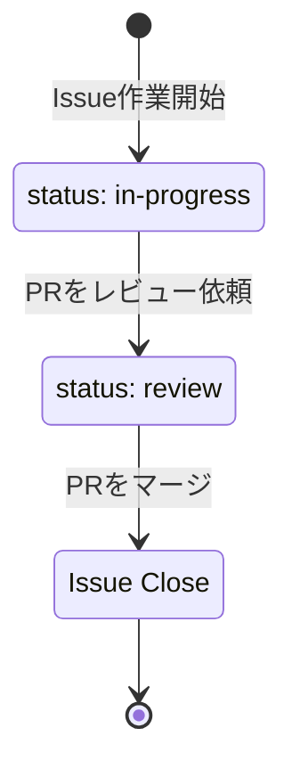

# GitHub Pull Request 作成ルール

## 1. 目的

本ルールは、GitHub Pull Request（PR）の書き方と運用を統一するためのものです。

以下を重視します。

- 何を変更した PR かが分かる
- 関連する Issue を追跡できる
- レビュー時に確認すべき内容が分かる
- 必要以上に PR 作成・管理へ時間をかけない

---

## 2. 基本ルール

Pull Request は以下のルールで作成します。

1. **1 PR = 1つの Issue / 目的**を基本とする
2. PR タイトルだけで変更内容がある程度分かるようにする
3. 「概要」「変更内容」「確認内容」「関連 Issue」を記載する
4. 原則として関連する Issue を参照する
5. レビュー可能な状態になってからレビューを依頼する
6. 大きすぎる変更は可能な範囲で PR を分割する

---

## 3. Pull Request を作成するタイミング

実装が完了し、以下を確認してから Pull Request を作成します。

- Issue がある場合は、その対応内容が実装されている
- ローカルで必要な動作確認を行っている
- 必要なテストを実施している
- 不要なデバッグコードや一時ファイルが含まれていない
- コミット対象に機密情報が含まれていない

作業途中で共有・相談したい場合は Draft Pull Request を使用しても構いません。

---

## 4. PR の粒度

原則として、**1つの Issue または1つの目的に対応する変更**を1つの PR とします。

### 良い例

```text
Geminiの公式リンクを追加する
Claude Codeの公式ドキュメントのリンク切れを修正する
READMEにリンク追加手順を追加する
```

### 大きすぎる例

```text
リンク集を全面的にリニューアルする
複数の無関係なバグをまとめて修正する
機能追加と大規模リファクタリングを同時に行う
```

Issue の目的と直接関係のない変更は、可能な限り別 PR とします。

---

## 5. PR タイトル

タイトルは、何を変更したのか分かる名称にします。

### 推奨

```text
Geminiの公式リンクを追加
スマートフォンでリンク一覧の表示が崩れる問題を修正
ページタイトルを変更
READMEにリンク追加手順を追加
```

### 避ける

```text
修正
対応
Issue対応
バグ修正
更新
変更
```

`[Feature]`、`[Bug]` などのプレフィックスは必須としません。

---

## 6. PR 本文

AI エージェントは、作業内容に対応する `.github/PULL_REQUEST_TEMPLATE/` のファイルを読み、その構成に沿って PR 本文を作成します。本文の見出し・作業別の項目は、実際のテンプレートファイルを基準にします。

### テンプレートの選択

| 作業内容 | ブランチの種類 | PR テンプレート |
|---|---|---|
| 機能追加・変更、リンク追加 | `feature` | [feature.md](../.github/PULL_REQUEST_TEMPLATE/feature.md) |
| バグ修正 | `fix` | [bug.md](../.github/PULL_REQUEST_TEMPLATE/bug.md) |
| ドキュメント修正 | `docs` | [documentation.md](../.github/PULL_REQUEST_TEMPLATE/documentation.md) |
### 人間が GitHub の画面から PR を作成する場合

本リポジトリでは PR テンプレートを作業の種類ごとに分けているため、GitHub の画面から通常の手順で PR を作成すると、**テンプレートは自動で入力されず本文が空になります。**

以下のいずれかの方法でテンプレートを使用してください。

**方法1：URL にテンプレート名を指定する（推奨）**

1. 作業ブランチを Push する
2. ブラウザで以下の形式の URL を開く（`<ブランチ名>` とテンプレートのファイル名を置き換える）

```text
https://github.com/takashi-kawamoto/ai-tools-official-links/compare/main...<ブランチ名>?quick_pull=1&template=feature.md
```

3. テンプレートが入力された PR 作成画面が開くので、空欄を埋めて「Create pull request」を押す

**方法2：テンプレートの内容を貼り付ける**

1. 通常の手順で PR 作成画面を開く
2. 上表のリンクからテンプレートを開き、「Raw」表示の内容をコピーして本文に貼り付ける

本文を書き終えたら、未記入の説明用コメント（`<!-- -->`）や空欄が残っていないか確認します。

### AI エージェントの作成手順

1. 関連 Issue がある場合は、その目的・対応内容・完了条件を確認する。あわせて、作業ブランチの `main` に対する差分と実施した確認・テストの結果を確認する。
2. 上表から作業の目的に合うテンプレートを選び、ローカルのファイル全文を読む。ブランチの種類は選択の目安とし、実際の作業内容と照合する。
3. テンプレートの見出し・作業別の項目を維持し、説明用コメントや空欄を実際の変更内容・確認結果で埋める。いずれの PR も「変更内容」には実際に行った変更を記載する。
4. 関連 Issue の記載は「7. Issue との関連付け」に従う。Issue がない場合は「なし」と記載し、`close #` のような未記入のプレースホルダーを残さない。
5. 本文と差分・確認結果を照合し、記載漏れや事実と異なる説明がないことを確認する。
6. 使用する PR 作成ツールに、完成した Markdown 全文を本文として明示的に渡す。作成後は PR の本文を読み戻し、意図した見出し・内容・チェック状態が反映されていることを確認する。

### 記載時の注意

- 「概要」には変更の目的と結果を簡潔に記載し、「変更内容」には実際に行った変更を記載する。
- 「確認内容」には実施した確認と結果を具体的に記載する。未実施の項目を `[x]` にせず、未実施の理由を「補足」に記載する。
- 「レビュー観点」がある場合は項目を維持する。AI のセルフレビューと人間のレビューを区別し、人間による確認・承認を代行したように記載しない。
- 「補足」は必要な場合のみ記載し、不要な場合は見出しごと削除する。
- 既存 PR の本文を更新する場合は、現在の本文を読んでから変更する。人間が追記した説明や判断を保持し、最新の差分・確認結果を反映する。

---

## 7. Issue との関連付け

Issue がある場合は、Pull Request から対象 Issue を参照します。軽微な修正などで Issue を作成していない場合は、「関連 Issue」に「なし」と記載します。

PR のマージと同時に Issue を Close する場合：

```text
Closes #123
```

単純に関連付ける場合：

```text
Related to #123
```

複数 Issue に関連する場合は、それぞれ記載します。

```text
Closes #123
Related to #124
```

Issue の完了条件をすべて満たす PR である場合は `Closes` を使用します。

---

## 8. 変更内容

「変更内容」には、レビュー担当者が変更の概要を把握できる内容を記載します。

### 例

```markdown
## 変更内容

- Gemini の公式 GitHub・公式ドキュメント・公式 X へのリンクを追加
- 既存ツールと同じ構成・表記で表示するよう調整
```

ファイル単位の変更一覧をそのまま記載する必要はありません。

---

## 9. 確認内容

実施した確認内容を記載します。

例：

```markdown
## 確認内容

- [x] 追加した各リンクから公式ページが開けることを確認
- [x] 既存ツールと同じ構成・表記で表示されることを確認
- [x] PC・スマートフォンのブラウザで表示崩れがないことを確認
```

確認していない項目を `[x]` にしないようにします。

テストを実施していない場合は、その理由を補足に記載します。

---

## 10. スクリーンショット

画面変更がある場合は、必要に応じてスクリーンショットを添付します。

特に以下の場合は添付を推奨します。

- UI の追加
- レイアウト変更
- 表示内容の変更
- Before / After がレビューに役立つ変更

ドキュメントやテンプレートのみの変更など、ページの表示に影響しない変更では不要です。

---

## 11. Draft Pull Request

以下の場合は Draft Pull Request を使用できます。

- 実装途中の内容を共有したい
- 設計・実装方針について相談したい
- 早い段階でレビューを受けたい

レビュー可能な状態になったら Ready for review に変更します。

---

## 12. レビュー依頼

レビューを依頼する前に以下を確認します。Issue がない場合は、Issue に関する項目を対象外として扱います。

```markdown
- [ ] Issue がある場合は、その対応内容を実施した
- [ ] Issue がある場合は、その完了条件を確認した
- [ ] 必要な動作確認を実施した
- [ ] 必要なテストを実施した
- [ ] 不要な変更が含まれていない
- [ ] 機密情報が含まれていない
- [ ] PR本文を記載した
- [ ] 関連 Issueを記載した（Issue がない場合は「なし」）
```

---

## 13. レビュー対応

レビューコメントへの対応後は、必要に応じて以下を行います。

- 指摘内容を修正する
- 修正不要の場合は理由をコメントする
- 追加の確認・テストを実施する
- 変更内容が大きく変わった場合は PR 本文を更新する

重要な判断は、後から経緯を確認できるよう PR コメントに残します。

---

## 14. PR の Status

PR の状態は GitHub の標準機能を基本として管理します。

| 状態 | 用途 |
|---|---|
| Draft | 実装中・相談中 |
| Ready for review | 実装完了・レビュー待ち |
| Merged | レビュー完了・マージ済み |
| Closed | マージせず終了 |

Issue 側で Status Label を使用している場合は、PR の進捗に合わせて更新します。

例：



作業が停止した場合は、Issue に `status: blocked` を設定し、理由をコメントに記載します。

---

## 15. マージ

**マージ操作は必ず人間が行います。** AI エージェントや自動化ツールによるマージ、GitHub の Auto-merge 機能は使用しません。詳細は [Git ブランチ運用ルール](./branch-rules.md) の「9. マージ」を参照してください。

マージ前の確認項目は、[Git ブランチ運用ルール](./branch-rules.md) の「9. マージ」の「マージ前の確認」に従います。

マージ方法は、[Git ブランチ運用ルール](./branch-rules.md) の「9. マージ」に従います（原則 **Squash and merge**）。

マージ後の作業ブランチは削除します。詳細は [Git ブランチ運用ルール](./branch-rules.md) の「10. マージ後のブランチ削除」を参照してください。

---

## 16. PR を Close する場合

実装を取りやめるなど、マージしない場合は PR を Close します。

必要に応じて、Close する理由をコメントに記載します。

関連 Issue が存在する場合は、Issue を Close するか、継続するかを確認します。

---

## 17. 禁止事項

以下は行いません。

- 内容が分からないタイトルで PR を作成する
- 無関係な変更を1つの PR にまとめる
- 動作確認を行わず、確認済みとして記載する
- 機密情報、パスワード、API キー、アクセストークン等を含める
- レビュー指摘を理由なく無視する
- Issue の完了条件を満たしていない状態で Issue を Close する
- AI エージェント・自動化ツールに PR をマージさせる

---

## 18. PR 作成チェックリスト

Pull Request 作成時に最低限以下を確認します。

```markdown
- [ ] PRタイトルから変更内容が分かる
- [ ] 概要を記載した
- [ ] 変更内容を記載した
- [ ] 確認内容を記載した
- [ ] 関連 Issueを記載した（Issue がない場合は「なし」）
- [ ] 不要な変更が含まれていない
- [ ] 機密情報が含まれていない
```

---

## 19. 運用方針

Pull Request の管理自体が負担にならないよう、以下を基本方針とします。

- PR本文を必要以上に長くしない
- コードから明らかな内容を細かく説明しすぎない
- Issue に記載済みの背景・仕様を PR に重複して記載しない
- PR では「実際に何を変更したか」と「何を確認したか」を重視する
- 重要な判断やレビュー結果は PR に残す

運用して不足を感じたルールのみ、後から追加します。
